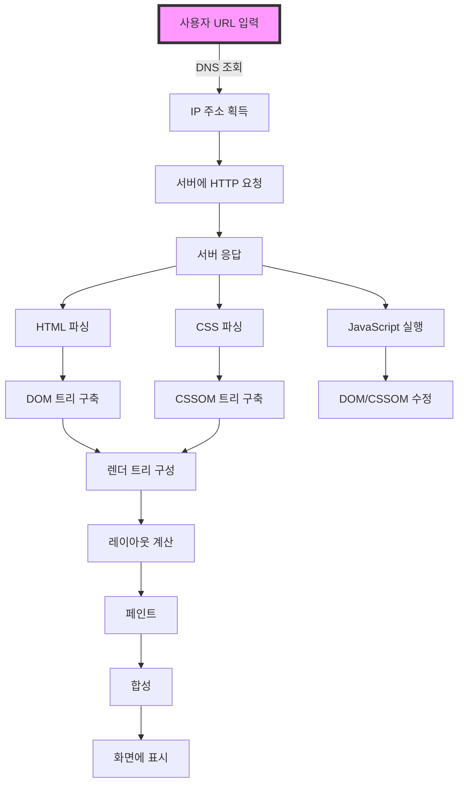
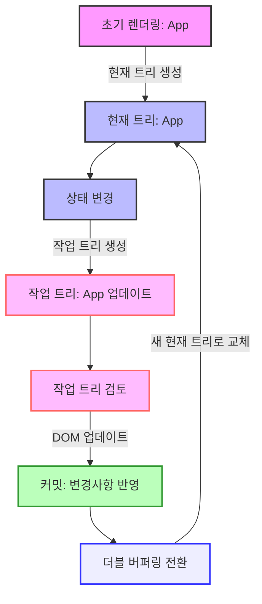
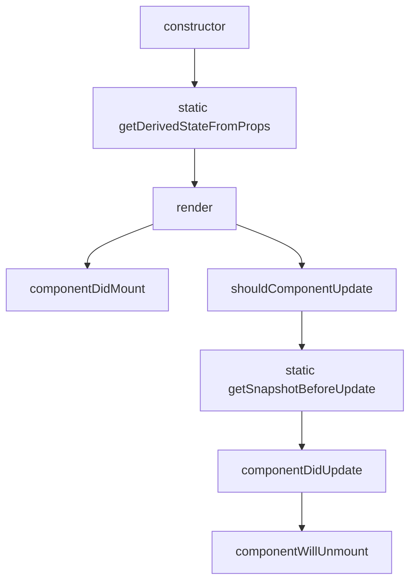
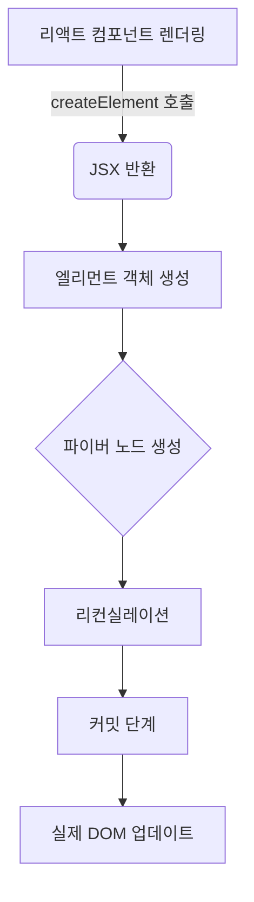

# 02장: 리액트 핵심 요소 깊게 살펴보기

리액트를 이루는 핵심 요소들을 깊게 살펴보고, 리액트의 렌더링 과정을 이해하는 장입니다.

<br>

- [02장: 리액트 핵심 요소 깊게 살펴보기](#02장-리액트-핵심-요소-깊게-살펴보기)
  - [2.1 JSX란?](#21-jsx란)
    - [2.1.1 JSX의 정의](#211-jsx의-정의)
      - [JSXElement](#jsxelement)
      - [JSXElementName](#jsxelementname)
      - [JSXAttributes](#jsxattributes)
    - [JSXChildren](#jsxchildren)
      - [JSXStrings](#jsxstrings)
    - [2.1.2 JSX 예제](#212-jsx-예제)
    - [2.1.3 JSX는 어떻게 자바스크립트에서 변환될까?](#213-jsx는-어떻게-자바스크립트에서-변환될까)
      - [JSX의 자바스크립트 변환](#jsx의-자바스크립트-변환)
      - [JSX에서 자바스크립트로의 변환 예시](#jsx에서-자바스크립트로의-변환-예시)
      - [추가 자료](#추가-자료)
  - [2.2 가상 DOM과 리액트 파이버](#22-가상-dom과-리액트-파이버)
    - [2.2.1 DOM과 브라우저 렌더링 과정](#221-dom과-브라우저-렌더링-과정)
      - [DOM (Document Object Model)](#dom-document-object-model)
      - [웹사이트 접근 요청부터 화면 그리는 과정](#웹사이트-접근-요청부터-화면-그리는-과정)
      - [1. 요청과 응답](#1-요청과-응답)
      - [2. 브라우저 처리 과정](#2-브라우저-처리-과정)
      - [3. 렌더링 과정](#3-렌더링-과정)
      - [4. 최적화와 성능](#4-최적화와-성능)
      - [예시: HTML, CSS, JavaScript 파일을 처리하는 브라우저](#예시-html-css-javascript-파일을-처리하는-브라우저)
      - [참고 자료](#참고-자료)
    - [2.2.2 가상 DOM의 탄생 배경](#222-가상-dom의-탄생-배경)
    - [2.2.3 가상 DOM을 위한 아키텍처, 리액트 파이버](#223-가상-dom을-위한-아키텍처-리액트-파이버)
      - [가상 DOM의 한계](#가상-dom의-한계)
      - [리액트 파이버란?](#리액트-파이버란)
      - [리액트 파이버(Fiber) 구현](#리액트-파이버fiber-구현)
      - [코드 예시](#코드-예시)
      - [리액트 파이버 트리](#리액트-파이버-트리)
      - [더블 버퍼링(Double Buffering)](#더블-버퍼링double-buffering)
      - [리액트 파이버 작업 순서](#리액트-파이버-작업-순서)
      - [1. 초기 렌더링](#1-초기-렌더링)
      - [2. 상태 변경 및 업데이트 시작](#2-상태-변경-및-업데이트-시작)
      - [3. 작업 트리 구성](#3-작업-트리-구성)
      - [4. 렌더링 및 커밋](#4-렌더링-및-커밋)
      - [5. 더블 버퍼링 전환](#5-더블-버퍼링-전환)
    - [2.2.4 파이버와 가상 DOM](#224-파이버와-가상-dom)
      - [가상 DOM(Virtual DOM)이란?](#가상-domvirtual-dom이란)
      - [가상 DOM의 이점](#가상-dom의-이점)
      - [가상 DOM을 다룰 때의 주의사항](#가상-dom을-다룰-때의-주의사항)
    - [참고자료](#참고자료)
    - [2.2.3 가상 DOM을 위한 아키텍처, 리액트 파이버](#223-가상-dom을-위한-아키텍처-리액트-파이버-1)
    - [2.2.4 파이버와 가상 DOM](#224-파이버와-가상-dom-1)
    - [2.2.5 정리](#225-정리)
  - [2.3 클래스형 컴포넌트와 함수형 컴포넌트](#23-클래스형-컴포넌트와-함수형-컴포넌트)
    - [2.3.1 클래스형 컴포넌트](#231-클래스형-컴포넌트)
      - [생명주기(life cycle) 메서드가 실행되는 시점](#생명주기life-cycle-메서드가-실행되는-시점)
      - [클래스 컴포넌트의 생명주기 메서드 호출 순서](#클래스-컴포넌트의-생명주기-메서드-호출-순서)
    - [2.3.2 함수형 컴포넌트](#232-함수형-컴포넌트)
    - [2.3.3 함수형 컴포넌트 vs. 클래스형 컴포넌트](#233-함수형-컴포넌트-vs-클래스형-컴포넌트)
    - [2.3.4 정리](#234-정리)
  - [2.4 렌더링은 어떻게 일어나는가?](#24-렌더링은-어떻게-일어나는가)
    - [2.4.1 리액트의 렌더링이란?](#241-리액트의-렌더링이란)
    - [2.4.2 리액트의 렌더링이 일어나는 이유](#242-리액트의-렌더링이-일어나는-이유)
    - [2.4.3 리액트의 렌더링 프로세스](#243-리액트의-렌더링-프로세스)
    - [2.4.4 렌더와 커밋](#244-렌더와-커밋)
    - [2.4.5 일반적인 렌더링 시나리오 살펴보기](#245-일반적인-렌더링-시나리오-살펴보기)
    - [2.4.6 정리](#246-정리)
  - [2.5 컴포넌트와 함수의 무거운 연산을 기억해 두는 메모이제이션](#25-컴포넌트와-함수의-무거운-연산을-기억해-두는-메모이제이션)
    - [2.5.1 주장 1: 섣부른 최적화는 독이다, 꼭 필요한 곳에만 메모이제이션을 추가하자](#251-주장-1-섣부른-최적화는-독이다-꼭-필요한-곳에만-메모이제이션을-추가하자)
    - [2.5.2 주장 2: 렌더링 과정의 비용은 비싸다, 모조리 메모이제이션해 버리자](#252-주장-2-렌더링-과정의-비용은-비싸다-모조리-메모이제이션해-버리자)
    - [2.5.3 결론 및 정리](#253-결론-및-정리)
  - [References](#references)
  - [Articles](#articles)


<br>

## 2.1 JSX란?

- JSX는 리액트(React)에서 사용되는 독자적인 문법으로, JavaScript XML의 약자입니다.
- JSX는 XML과 유사한 내장형 구문을 가지고 있어서 HTML과 비슷한 형태로 JavaScript 코드 안에 마크업을 작성할 수 있습니다. 그러나 JSX는 자바스크립트 표준 문법이 아니며, 자바스크립트 엔진에서 바로 실행되지 않습니다. 대신, JSX는 바벨과 같은 트랜스파일러를 통해 일반 자바스크립트 형태의 코드로 변환되어 실행됩니다.
- JSX의 설계 목적은 다양한 트랜스파일러에서 다양한 속성을 가진 트리 구조를 토큰화해 ECMAScript로 변환하는 것입니다.

```jsx
```

### 2.1.1 JSX의 정의

#### JSXElement

JSXElement는 JSX 문법을 사용하여 생성한 React 컴포넌트를 나타냅니다. JSXElement는 HTML 태그와 유사한 구조를 가지며, React 컴포넌트를 생성하고 렌더링하는 데 사용됩니다.

| 구성 요소             | 설명                                                                                     | 예시                            |
| --------------------- | ---------------------------------------------------------------------------------------- | ------------------------------- |
| JSXOpeningElement     | JSXElement의 시작 부분을 나타내며, `<`로 시작하고 태그 이름과 속성을 포함합니다.         | `<div>`                         |
| JSXClosingElement     | JSXElement의 끝 부분을 나타내며, `</`로 시작하고 태그 이름을 포함합니다.                 | `</div>`                        |
| JSXSelfClosingElement | 자체 닫히는 태그를 나타내며, `<`로 시작하고 태그 이름과 속성을 포함하며, `/`로 닫습니다. | ``       |
| JSXFragment           | 빈 태그로 이루어진 구조를 나타내며, 여러 컴포넌트를 묶어서 반환할 수 있습니다.           | `<></>`                         |
| JSXElement            | 위의 구성 요소를 조합하여 JSXElement를 생성할 수 있습니다.                               | `<div><span>Hello</span></div>` |

```jsx
// JSXElement 예제
const element = (
    <div>
        <h1>Hello, world!</h1>
        <p>Welcome to React!</p>
    </div>
);

// JSXSelfClosingElement 예제
const image = ;

// JSXFragment 예제
const fragment = (
    <>
        <ChildA />
        <ChildB />
    </>
);
```

#### JSXElementName

JSXElementName은 JSXElement의 이름을 나타냅니다. JSXElementName은 JSX 문법에서 사용되는 요소의 이름을 정의합니다.

| 구성 요소           | 설명                                                                                | 예시                 |
| ------------------- | ----------------------------------------------------------------------------------- | -------------------- |
| JSXIdentifier       | JSXElementName의 식별자로, 소문자로 시작하는 컴포넌트의 이름입니다.                 | `<div>`              |
| JSXNamespacedName   | 네임스페이스가 있는 JSXElementName으로, 콜론으로 구분된 접두사를 포함한 이름입니다. | `<my:component>`     |
| JSXMemberExpression | 객체의 속성에 접근하는 멤버 표현식으로 구성된 JSXElementName입니다.                 | `<MyComponent.Item>` |

| JSXElementName          | 구성 요소를 조합하여 JSXElementName을 생성할 수 있습니다.                                  |
| ----------------------- | ------------------------------------------------------------------------------------------ |
| `<식별자>`              | JSXIdentifier를 사용하여 간단한 JSXElementName을 생성합니다.                               |
| `<네임스페이스:식별자>` | JSXNamespacedName을 사용하여 네임스페이스가 지정된 컴포넌트 이름을 생성합니다.             |
| `<식별자.식별자>`       | JSXMemberExpression을 사용하여 객체의 속성을 나타내는 복합적인 컴포넌트 이름을 생성합니다. |

```jsx
// JSXIdentifier 예제
const element = <div>Hello, world!</div>;

// JSXNamespacedName 예제
const element = <my:component>Hello, world!</my:component>;

// JSXMemberExpression 예제
const element = <MyComponent.Item>Hello, world!</MyComponent.Item>;
```

#### JSXAttributes

JSXAttributes는 JSXElement의 속성을 나타냅니다. JSXAttributes는 HTML 태그의 속성과 유사한 방식으로 작성되며, 컴포넌트에 추가적인 정보를 전달하는 데 사용됩니다.

| 구성 요소          | 설명                                                                              | 예시                              |
| ------------------ | --------------------------------------------------------------------------------- | --------------------------------- |
| JSXAttribute       | JSX 요소에 추가되는 속성을 나타냅니다.                                            | `type="text"`                     |
| JSXAttributeName   | JSX 속성의 이름을 나타냅니다.                                                     | `type`                            |
| JSXAttributeValue  | JSX 속성의 값을 나타내며, 문자열 또는 중괄호 `{}`로 감싼 표현식이 될 수 있습니다. | `"text"` 또는 `{this.state.text}` |
| JSXSpreadAttribute | 객체의 속성들을 JSX 요소에 스프레드 문법을 사용하여 전개합니다.                   | `{...props}`                      |

| JSXAttributes의 예                    | 설명                                                                                         |
| ------------------------------------- | -------------------------------------------------------------------------------------------- |
| `<input type="text" />`               | `type`이라는 이름의 JSXAttribute를 사용하여 속성을 정의합니다.                               |
| `<div {...props} />`                  | `props` 객체에 있는 모든 속성을 `<div>` 요소에 스프레드 속성으로 전개합니다.                 |
| `<button {...props} type="button" />` | `props` 객체를 스프레드 속성으로 전개하고, `type` 속성을 추가하여 JSXAttribute를 조합합니다. |

```jsx
// JSXAttribute 예제
const element = <input type="text" />;
const element = <input type={this.state.type} />;
const element = <input type="text" value={this.state.text} />;
const element = <input type="text" {...props} />;
const element = <input type="text" {...props} value={this.state.text} />;
const element = <input type="text" {...props} {...attrs} />;
```

### JSXChildren

JSXChild는 JSXChildren을 구성하는 자식 요소를 나타냅니다. JSXChild는 JSXText, JSXElement, JSXFragment, JSXChildExpression 중 하나일 수 있으며, 여러 개의 자식 요소가 포함될 수 있습니다.

| 구성 요소          | 설명                                                                                                   | 예시                               |
| ------------------ | ------------------------------------------------------------------------------------------------------ | ---------------------------------- |
| JSXText            | JSXElement 안에 직접 작성된 텍스트 내용을 나타내며, HTML 태그가 아닌 일반 텍스트로 처리됩니다.         | "Hello, world!"                    |
| JSXElement         | HTML 태그나 다른 컴포넌트를 나타내며, 중첩된 구조로 작성할 수 있고 JSXChildren을 가질 수 있습니다.     | `<div>Hello, world!</div>`         |
| JSXFragment        | 여러 자식 요소를 그룹화하지만 추가적인 DOM 엘리먼트를 추가하지 않는 컨테이너 역할을 합니다.            | `<><ChildA /><ChildB /></>`        |
| JSXChildExpression | 중괄호 `{}`로 감싼 JavaScript 표현식을 나타냅니다. JSXElement 안에서 동적인 값을 표현할 때 사용됩니다. | `{true ? <ChildA /> : <ChildB />}` |

| JSXChildren | 구성 요소를 조합하여 JSXChildren을 생성할 수 있습니다.                                       |
| ----------- | -------------------------------------------------------------------------------------------- |
| `<텍스트>`  | JSXText를 사용하여 간단한 텍스트 노드를 자식 요소로 생성합니다.                              |
| `<></>`     | JSXFragment를 사용하여 여러 자식 요소를 그룹화하지만, 추가 DOM 엘리먼트 없이 생성합니다.     |
| `{표현식}`  | JSXChildExpression을 사용하여 JavaScript 표현식을 계산하여 그 결과를 자식 요소로 생성합니다. |


```jsx
// JSXText 예제
const element = <div>Hello, world!</div>;

// JSXFragment 예제
const element = (
    <>
        <ChildA />
        <ChildB />
    </>
);

// JSXChildExpression 예제
const element = <div>{true ? <ChildA /> : <ChildB />}</div>;
```

#### JSXStrings

JSXStrings은 JSXElement에서 사용되는 문자열 리터럴을 나타냅니다. JSXStrings은 JSX 속성 값이나 텍스트 노드로 사용됩니다.

| 구성 요소     | 설명                                                                                                    |
| ------------- | ------------------------------------------------------------------------------------------------------- |
| 일반 문자열   | 일반적인 문자열 리터럴을 나타냅니다. 작은 따옴표(') 또는 큰 따옴표(")로 감싸져 있습니다.                |
| 템플릿 리터럴 | 백틱(`)으로 감싸진 템플릿 리터럴을 나타냅니다. 템플릿 리터럴 안에는 변수나 표현식을 삽입할 수 있습니다. |


```jsx
// 일반 문자열 예제
const element = <div>Hello, world!</div>;

// 템플릿 리터럴 예제
const element = <div>{`Hello, ${name}!`}</div>;
```

### 2.1.2 JSX 예제


```jsx
```

### 2.1.3 JSX는 어떻게 자바스크립트에서 변환될까?

#### JSX의 자바스크립트 변환

JSX는 리액트(React)를 개발할 때 사용되는 구문입니다. 이 구문은 마크업과 함께 자바스크립트를 섞어서 쓸 수 있게 해 줍니다. 하지만 브라우저는 JSX를 직접 이해할 수 없기 때문에 JSX 코드는 자바스크립트 코드로 변환되어야 합니다. 이 과정을 **"트랜스파일링"**이라고 하며, 주로 Babel 같은 트랜스파일러를 사용해서 진행됩니다.

#### JSX에서 자바스크립트로의 변환 예시

예를 들어, JSX에서 사용된 다음 코드를 봅시다:

```jsx
const element = <h1>Hello, world!</h1>;
```

이 코드는 Babel을 통해 다음과 같은 자바스크립트 코드로 변환됩니다.

```javascript
const element = React.createElement("h1", null, "Hello, world!");
```

여기서 `React.createElement()` 함수는 세 개의 인자를 받습니다.

1. 태그의 이름 (예: `"h1"`)
2. 해당 태그의 속성 (여기서는 속성이 없으므로 `null`)
3. 자식 요소들 (이 경우는 텍스트 `"Hello, world!"`)

이 함수는 실제로 브라우저가 이해할 수 있는 객체를 생성하는데, 이 객체는 React가 DOM에 적절히 렌더링 할 수 있도록 구성됩니다.

#### 추가 자료

- JSX를 더 깊게 이해하고 싶다면, Babel의 [온라인 트라이아웃](https://babeljs.io/repl)에서 직접 JSX 코드를 자바스크립트로 변환해 볼 수 있습니다.
- React 공식 문서에서 JSX의 작동 방식에 대해 자세히 설명하고 있으므로 [React 문서](https://ko.reactjs.org/docs/introducing-jsx.html)를 참고하는 것도 좋습니다.

이러한 변환 과정을 통해 JSX는 더 편리하고 직관적인 UI 코드를 작성할 수 있게 해 주면서도, 최종적으로는 자바스크립트가 실행될 수 있는 형태로 관리됩니다.

<br>

## 2.2 가상 DOM과 리액트 파이버

가상DOM이 무엇인지, 그리고 실제 DOM에 비해 어떤 이점이 있는지 살펴보고 가상 DOM을 다룰 때 주의할 점에 대해서 알아보자.

### 2.2.1 DOM과 브라우저 렌더링 과정

#### DOM (Document Object Model)

DOM은 HTML 및 XML 문서의 프로그래밍 인터페이스입니다. 웹 브라우저는 HTML 문서를 받아 이를 파싱하여, 문서의 구조화된 표현인 DOM을 생성합니다. DOM은 문서의 모든 요소, 속성, 텍스트 등을 객체로 다룰 수 있게 해주며, JavaScript 등의 스크립트 언어를 통해 이 객체들을 동적으로 조작할 수 있습니다.

#### 웹사이트 접근 요청부터 화면 그리는 과정

#### 1. 요청과 응답
- **사용자 입력 처리**: 사용자가 URL을 브라우저 주소창에 입력하면, 브라우저는 이를 해석하여 해당 서버에 접근합니다.
- **DNS 조회**: 도메인 이름을 IP 주소로 변환하기 위해 DNS 서버를 조회합니다.
- **서버 요청**: 브라우저는 HTTP 프로토콜을 사용하여 서버에 웹페이지 데이터를 요청합니다.
- **서버 응답**: 서버는 요청 받은 URL에 해당하는 데이터(HTML, CSS, JavaScript 등)를 브라우저에게 전달합니다.

#### 2. 브라우저 처리 과정
- **HTML 파싱**: 브라우저는 서버로부터 받은 HTML 문서를 파싱하여 DOM 트리를 구축합니다.
- **CSS 파싱**: 동시에 CSS 파일들을 파싱하여 CSSOM 트리를 구성합니다.
- **JavaScript 처리**: HTML 내에 포함되거나 외부에서 로드된 JavaScript 코드는 실행되어 DOM이나 CSSOM을 변경할 수 있습니다.
  
#### 3. 렌더링 과정
- **렌더 트리 구성**: DOM과 CSSOM을 결합하여 화면에 그려질 요소만을 포함하는 렌더 트리를 구성합니다.
- **레이아웃 계산**: 렌더 트리의 각 노드가 화면의 어느 위치에 표시될지 크기와 위치를 계산합니다.
- **페인트**: 계산된 레이아웃에 따라 요소를 화면에 그리는 과정을 진행합니다.
- **합성(Compositing)**: 여러 레이어를 합성하여 최종적으로 사용자에게 보여지는 화면을 완성합니다.

#### 4. 최적화와 성능
- **캐시 활용**: 한 번 로드된 자원은 브라우저 캐시에 저장되어, 재방문시 빠르게 로드될 수 있습니다.
- **비동기 로딩**: JavaScript와 CSS는 비동기적으로 로딩 및 실행될 수 있어, 페이지 로딩 시간을 단축시킬 수 있습니다.



#### 예시: HTML, CSS, JavaScript 파일을 처리하는 브라우저

웹사이트 접근 요청부터 화면에 표시되는 과정을 이해하기 위해, 브라우저가 어떻게 HTML, CSS, JavaScript를 처리하고 페이지를 렌더링하는지 코드 예시를 통해 살펴 보겠습니다.

```html
<!DOCTYPE html>
<html lang="ko">
<head>
    <meta charset="UTF-8">
    <meta name="viewport" content="width=device-width, initial-scale=1.0">
    <title>성능 최적화된 웹 페이지</title>
    <link rel="stylesheet" href="styles.css" async>
    <script src="script.js" defer></script>
</head>
<body>
    <header>
        <h1>웹사이트 제목</h1>
        <nav>
            <ul>
                <li><a href="#">홈</a></li>
                <li><a href="#">서비스</a></li>
                <li><a href="#">연락처</a></li>
            </ul>
        </nav>
    </header>
    <main>
        <section>
            <h2>주요 내용</h2>
            <p id="demo">이 페이지는 성능 최적화를 고려하여 설계되었습니다.</p>
        </section>
    </main>
    <footer>
        <p>© 2024 회사명. 모든 권리 보유.</p>
    </footer>
</body>
</html>
```
> JavaScript는 defer 속성을 사용하여 문서 파싱 후에 실행되도록 함으로써 렌더링 차단을 방지합니다.

```css
/* styles.css */
body, html {
    margin: 0;
    padding: 0;
    font-family: Arial, sans-serif;
}

header, main, footer {
    text-align: center;
    padding: 20px;
}

nav ul {
    list-style: none;
    padding: 0;
}

nav ul li {
    display: inline;
    margin-right: 10px;
}
```

```javascript
document.addEventListener('DOMContentLoaded', () => {
    console.log('DOM이 로드되고 파싱되었습니다.');

    const demo = document.getElementById('demo');
    modifyTextContent(demo, '문단의 내용이 변경되었습니다!');
    addEventListener(demo);

    const newElement = createElement('p', '새로운 문단이 추가되었습니다!');
    styleElement(newElement);
});

function modifyTextContent(element, text) {
    element.textContent = text;
}

function addEventListener(element) {
    element.addEventListener('click', () => {
        alert('문단을 클릭했습니다!');
    });
}

function createElement(elementType, text) {
    const newElement = document.createElement(elementType);
    newElement.textContent = text;
    document.body.appendChild(newElement);
    return newElement;
}

function styleElement(element) {
    element.style.color = 'red';
    element.style.fontSize = '1.5em';
    element.style.fontWeight = 'bold';
    element.style.marginTop = '20px';
    element.style.textAlign = 'center';
}
```

1. HTML과 CSS 로드 및 파싱

    웹 페이지가 로드될 때, 브라우저는 HTML 파일을 서버로부터 가져와 순차적으로 파싱합니다. 이 과정에서 HTML 내의 링크된 자원(예: CSS, JavaScript 파일)도 요청하게 됩니다.

2. CSS 파싱

    브라우저는 `<link>` 태그를 통해 참조된 CSS 파일을 로드하고 파싱하여 스타일 정보를 CSSOM에 저장합니다.

3. JavaScript 로딩 및 실행

    HTML 파싱 중 `<script>` 태그를 만나면, JavaScript 파일을 로드하고 실행합니다. 이 스크립트는 DOM을 조작할 수 있으며, 이는 렌더 트리 구축 전이나 후에 실행될 수 있습니다.

    ```javascript
    document.getElementById('demo').textContent = '문단의 내용이 변경되었습니다!';
    ```

4. 렌더 트리 구성

    DOM과 CSSOM이 준비되면, 브라우저는 이들을 결합하여 렌더 트리를 구성합니다. 렌더 트리는 화면에 실제로 표시되는 요소들만 포함합니다.

5. 레이아웃 계산

    렌더 트리가 완성되면, 각 노드의 화면상 위치와 크기를 계산하는 레이아웃 과정이 진행됩니다.

6. 페인트

    레이아웃 계산 후, 각 요소를 화면에 그리는 페인트 과정이 진행됩니다. 이는 픽셀 단위로 요소의 시각적 표현을 생성합니다.

7. 합성

    최종적으로, 여러 레이어를 합성하여 최종 화면을 사용자에게 보여줍니다. 이 과정에서 하드웨어 가속을 사용할 수도 있습니다.

> 자바스크립트 비동기 로딩(`async`와 `defer` 속성 사용), CSS 및 자바스크립트의 최적화, 이미지와 리소스의 적절한 캐싱 및 로딩 전략 등을 통해 사용자 경험을 향상시킬 수 있습니다.

#### 참고 자료
- [MDN - 브라우저의 웹 문서 처리 과정](https://developer.mozilla.org/ko/docs/Learn/Getting_started_with_the_web/How_the_Web_works)
- [Google Developers - Critical Rendering Path](https://developers.google.com/web/fundamentals/performance/critical-rendering-path)


### 2.2.2 가상 DOM의 탄생 배경

가상 DOM은 실제 DOM을 추상화한 개념으로, 리액트 초기 버전에서 도입되어 컴포넌트의 상태가 변경될 때 전체 UI를 효율적으로 업데이트할 수 있는 기능을 제공했습니다. 실제 DOM은 조작 비용이 매우 높기 때문에, 가상 DOM을 사용하여 먼저 변경 사항을 가상의 트리에 적용한 다음, 변경된 부분만 실제 DOM에 반영하는 방식으로 성능을 크게 개선할 수 있었습니다.

### 2.2.3 가상 DOM을 위한 아키텍처, 리액트 파이버

#### 가상 DOM의 한계

가상 DOM은 많은 성능 문제를 해결했지만, 큰 규모의 애플리케이션에서는 여전히 몇 가지 문제점이 있었습니다. 특히, UI 렌더링 작업을 시작하면 중단할 수 없다는 점에서, 복잡한 애플리케이션에서 UI 응답성이 떨어질 수 있습니다. 모든 업데이트를 동기적으로 처리하다 보니 사용자 상호작용 같은 작업을 처리하기 전에 렌더링 작업을 완료해야 했고, 이로 인해 애플리케이션의 응답성이 저하될 수 있었습니다.

#### 리액트 파이버란?

리액트의 파이버(Fiber) 아키텍처는 리액트의 핵심 재조정 알고리즘을 재구현한 것으로, 애플리케이션의 UI를 더 효율적으로 렌더링할 수 있도록 설계되었습니다. 파이버 재조정자(Fiber Reconciler)는 이 아키텍처의 중심에 있는 구성 요소로, 컴포넌트 트리의 변화를 비교하고 효율적으로 업데이트하는 작업을 담당합니다. 

**[파이버(Fiber) 아키텍처]**

파이버는 리액트의 내부 작업 단위로, 컴포넌트의 렌더링, 업데이트, 훅 처리 등을 관리합니다. 각 파이버는 컴포넌트 인스턴스에 대한 정보를 가지며, 이는 렌더링에 필요한 상태와 DOM 노드에 대한 참조, 해당 작업의 우선순위 등을 포함합니다.

**[파이버의 주요 특징]**

- **인터럽트 가능한 렌더링**: 파이버 아키텍처는 렌더링 과정을 중단하고 필요한 경우 다른 작업에 CPU 자원을 할당한 후 다시 렌더링을 재개할 수 있도록 합니다. 이를 통해 애플리케이션의 응답성을 향상시킬 수 있습니다.
- **우선순위 기반의 작업 스케줄링**: 다양한 업데이트 작업에 우선순위를 부여하여, 사용자 인터랙션과 같은 중요한 작업을 우선적으로 처리할 수 있습니다.
- **동시성(concurrency)**: 여러 작업을 동시에 처리할 수 있는 능력을 통해 더 부드러운 사용자 경험을 제공합니다.

**[파이버 재조정자(Fiber Reconciler)]**

재조정 과정은 리액트가 가상 DOM 트리에서 이전 상태와 새 상태를 비교하여 실제 DOM에 반영해야 할 변경사항을 결정하는 과정입니다. 파이버 재조정자는 이 과정을 효율적으로 관리하기 위해 개발되었습니다.

**파이버 재조정자의 역할:**

1. **트리 비교**: 새로운 상태로 컴포넌트가 렌더링되었을 때, 변경 전과 변경 후의 컴포넌트 트리를 비교합니다.
2. **업데이트 결정**: 변경된 부분만을 식별하고, 필요한 업데이트를 결정합니다.
3. **배치 업데이트**: 여러 업데이트를 그룹화하여 효율적으로 실행합니다.


#### 리액트 파이버(Fiber) 구현

앞서 말한 것처럼 리액트 파이버 아키텍처는 리액트의 기존 재조정 과정을 개선하고, 비동기 렌더링 기능을 통합하여 애플리케이션의 성능을 최적화하고, 동시성을 지원합니다. 파이버는 각각의 리액트 컴포넌트에 대한 작업 단위로 이해될 수 있으며, 이는 리액트의 내부에서 컴포넌트의 라이프사이클과 상태 변경, 우선순위 등을 관리합니다.


**[파이버의 구조적 구성]**

각 파이버는 특정 컴포넌트의 인스턴스에 해당하는 작업 단위를 나타내며, 다음과 같은 정보를 포함합니다.

- **Type**: 컴포넌트의 타입 (예: 클래스 컴포넌트, 함수형 컴포넌트)
- **Key**: 리스트 내 컴포넌트를 구별하는 데 사용되는 유일한 키
- **StateNode**: 컴포넌트의 실제 인스턴스 또는 상태
- **Child**: 컴포넌트의 자식 컴포넌트에 대한 참조
- **Sibling**: 동일한 부모를 가진 다음 형제 컴포넌트에 대한 참조
- **Return**: 컴포넌트의 부모에 대한 참조
- **MemoizedState**: 컴포넌트의 이전 렌더링에서 계산된 상태
- **Effect**: 수행할 부수 효과(예: 업데이트, 마운트, 언마운트)를 나타냄

**[파이버 작업의 처리]**

파이버는 리액트가 UI를 업데이트할 때 발생하는 다양한 타입의 작업을 비동기적으로 처리할 수 있도록 합니다. 

1. **작업 스케줄링**: 파이버는 렌더링 작업을 여러 단계로 나누고, 필요에 따라 작업을 중단하거나 우선순위를 변경할 수 있습니다. 이를 통해 중요한 작업을 우선적으로 처리하고, 리소스를 효율적으로 관리할 수 있습니다.

2. **인터럽트 및 재개**: 파이버는 작업을 인터럽트할 수 있으며, 이는 사용자 상호작용과 같은 더 중요한 작업을 처리하기 위해 현재 진행 중인 작업을 일시 중지할 수 있음을 의미합니다. 작업은 나중에 다시 재개될 수 있습니다.

3. **우선순위 기반 실행**: 다양한 작업에는 서로 다른 우선순위가 부여될 수 있으며, 파이버는 이러한 우선순위에 따라 작업을 조정합니다. 예를 들어, 애니메이션 관련 작업은 사용자 입력 처리보다 낮은 우선순위를 가질 수 있습니다.

#### 코드 예시
리액트 소스 코드에서 파이버는 다음과 같이 정의될 수 있습니다.

```javascript
function FiberNode(tag, pendingProps, key, mode) {
  // 인스턴스 초기화
  this.tag = tag;
  this.key = key;
  this.elementType = null;
  this.type = null;
  this.stateNode = null;

  // 트리 구조
  this.return = null;
  this.child = null;
  this.sibling = null;
  this.index = 0;

  // 작업과 관련된 부분
  this.ref = null;
  this.pendingProps = pendingProps;
  this.memoizedProps = null;
  this.updateQueue = null;
  this.memoizedState = null;
  this.effects = null;
}

// 파이버 노드 생성
const fiberNode = new FiberNode(WorkTag.ClassComponent, { /* props */ }, 'componentKey', ReactMode.Concurrent);
```

이러한 구조와 처리 방식은 리액트가 UI를 효율적으로 업데이트하고 사용자 경험을 개선하는 데 기여합니다.

#### 리액트 파이버 트리

리액트 파이버 트리는 컴포넌트의 계층적 구조를 나타내는 내부 데이터 구조입니다. 각각의 파이버 노드는 리액트 컴포넌트 인스턴스에 대응되며, 컴포넌트의 타입, 상태, 속성(Props), 자식 컴포넌트들과 같은 정보를 포함합니다.

- **트리 구조**: 파이버 트리는 컴포넌트 간의 부모-자식 관계를 나타내며, 각 노드는 자신의 자식 노드를 가리킬 수 있습니다. 이 구조는 컴포넌트가 업데이트될 때 재조정(Reconciliation) 과정을 효율적으로 수행하게 도와줍니다.
- **재조정 과정**: 파이버는 기존의 재조정 알고리즘을 개선하여 변경사항을 효율적으로 처리합니다. 컴포넌트의 상태가 변경될 때, 리액트는 변경된 컴포넌트를 중심으로 파이버 트리를 업데이트하며, 필요한 경우에만 실제 DOM에 반영합니다.

#### 더블 버퍼링(Double Buffering)

더블 버퍼링은 주로 그래픽스 프로그래밍에서 볼 수 있는 기술로, 두 개의 버퍼를 사용하여 화면의 깜빡임 없이 부드러운 이미지 전환을 가능하게 합니다. 리액트에서는 이 기술을 응용하여 두 개의 파이버 트리를 사용합니다.

- **작동 원리**: 리액트는 현재 화면에 표시된 컴포넌트의 상태를 나타내는 "현재 트리"와 새로 업데이트되어야 할 상태를 나타내는 "작업 트리"를 동시에 관리합니다. 이를 통해 리액트는 비동기적으로 화면 업데이트를 준비할 수 있으며, 준비가 완료되면 두 트리의 역할을 바꿔치기하여 화면을 업데이트합니다.
- **성능 이점**: 이 방식은 변경사항을 실제 DOM에 적용하기 전에 모든 계산을 완료할 수 있도록 해, 화면의 깜빡임이나 레이아웃 이동 없이 부드러운 사용자 경험을 제공합니다.

더블 버퍼링은 리액트가 UI 업데이트를 더욱 효율적으로 관리하게 해주며, 특히 대규모 업데이트가 필요할 때 렌더링 성능을 크게 개선합니다. 

#### 리액트 파이버 작업 순서

리액트의 더블 버퍼링을 이용한 작업 순서를 이해하기 위해 코드와 함께 단계별로 설명하겠습니다. 리액트에서는 실제로 '현재 트리(Current Tree)'와 '작업 트리(Work-in-progress Tree)'를 이용하여 업데이트 프로세스를 관리합니다. 아래의 코드 예시는 이러한 프로세스를 단순화하여 설명하고 있습니다.

#### 1. 초기 렌더링

초기 렌더링 과정에서 리액트는 DOM을 구성하기 위한 초기 파이버 트리를 생성합니다.

```javascript
function renderInitialTree(rootElement, container) {
  const currentFiber = createFiberFromElement(rootElement);
  container.appendChild(currentFiber.stateNode);
}

const rootElement = <App />; // JSX -> React.createElement()로 변환됨
const container = document.getElementById('root');
renderInitialTree(rootElement, container);
```

#### 2. 상태 변경 및 업데이트 시작

사용자 상호작용 또는 데이터 변경으로 인해 상태가 변경되면, 리액트는 이 변경을 반영하기 위해 작업 트리를 생성합니다.

```javascript
function updateComponent(fiber) {
  const updatedFiber = {
    ...fiber,
    props: {...fiber.props, updated: true}, // 새로운 속성이나 상태로 업데이트
    stateNode: {...fiber.stateNode, updated: true},
    tag: 'UPDATE'
  };
  return updatedFiber;
}
```

#### 3. 작업 트리 구성

리액트는 현재 트리를 복사하여 변경 사항을 적용한 새로운 '작업 트리'를 구성합니다. 이 단계에서는 변경이 필요한 컴포넌트만 업데이트됩니다.

```javascript
function performWork(rootFiber) {
  const workInProgressTree = updateComponent(rootFiber); // 변경 사항을 적용한 새 트리 생성
  return workInProgressTree;
}

const workInProgressTree = performWork(currentFiber);
```

#### 4. 렌더링 및 커밋

모든 변경 사항이 작업 트리에 적용되면, 리액트는 이 트리를 검토하고 최종적으로 DOM에 커밋하여 업데이트를 반영합니다.

```javascript
function commitChanges(workInProgressTree, container) {
  // 실제 DOM에 변경사항 반영
  container.firstChild.replaceWith(workInProgressTree.stateNode);
}

commitChanges(workInProgressTree, container);
```

#### 5. 더블 버퍼링 전환

업데이트가 완료되면, 작업 트리는 새로운 '현재 트리'가 되고, 이전의 현재 트리는 버려집니다. 이것이 더블 버퍼링의 핵심입니다.

```javascript
currentFiber = workInProgressTree; // 새 현재 트리로 교체
```

이 코드 예시는 리액트의 더블 버퍼링을 이용한 작업 순서를 단순화하여 설명한 것입니다. 실제 리액트 내부에서는 이러한 프로세스가 훨씬 더 복잡하며, 다양한 최적화와 조건부 로직이 포함됩니다. 이러한 메커니즘이 리액트 애플리케이션에서 높은 성능과 효율적인 업데이트를 가능하게 합니다.




- **초기 렌더링**: 애플리케이션이 처음 로드될 때 초기 렌더링을 통해 '현재 트리'가 생성됩니다.
- **상태 변경**: 사용자 인터랙션 또는 데이터 업데이트로 인해 컴포넌트의 상태가 변경됩니다.
- **작업 트리 생성**: 상태 변경에 따라 새로운 '작업 트리'가 생성되어 업데이트가 준비됩니다.
- **작업 트리 검토**: 리액트는 작업 트리를 검토하여 필요한 변경사항을 결정합니다.
- **DOM 업데이트 (커밋)**: 준비된 변경사항이 실제 DOM에 반영됩니다.
- **더블 버퍼링 전환**: 업데이트가 완료된 후, 작업 트리는 '현재 트리'로 교체되며, 이전의 현재 트리는 제거됩니다.


### 2.2.4 파이버와 가상 DOM

#### 가상 DOM(Virtual DOM)이란?

가상 DOM은 실제 DOM(Document Object Model)의 가벼운 사본으로 생각할 수 있습니다. 이는 웹 페이지의 요소들을 메모리 내에 추상화하여 저장하고, 실제 DOM에 변경을 적용하기 전에 가상 DOM에서 먼저 업데이트를 진행합니다. 이 과정을 통해 필요한 최소한의 DOM 조작만을 실제 DOM에 적용함으로써 성능을 개선할 수 있습니다.

#### 가상 DOM의 이점

1. **성능 향상**: 가상 DOM은 실제 DOM의 업데이트를 최적화하여 처리합니다. 실제 DOM 조작은 비용이 많이 드는 작업인데, 가상 DOM은 변경 사항을 메모리에서 빠르게 처리하고 최종적으로 실제 DOM에는 필요한 변경만을 반영합니다. 이는 렌더
2. 링 시간을 단축시켜 성능을 크게 향상시킵니다.
   
3. **효율적인 업데이트**: 가상 DOM은 컴포넌트의 이전 상태와 비교하여 실제로 변경이 필요한 부분만을 식별하고 업데이트합니다. 이로 인해 불필요한 업데이트가 줄어들어 효율성이 증가합니다.

4. **개발의 용이성**: 개발자는 실제 DOM의 세부적인 동작 방식을 깊게 이해하지 않고도 UI를 쉽게 구축할 수 있습니다. 가상 DOM을 사용하는 라이브러리나 프레임워크(예: React, Vue.js)가 많은 복잡한 처리를 추상화하고 간소화해 줍니다.

#### 가상 DOM을 다룰 때의 주의사항

1. **메모리 사용량**: 가상 DOM은 메모리 내에 전체 DOM의 복사본을 유지합니다. 따라서 대규모의 애플리케이션에서는 메모리 사용량이 증가할 수 있으며, 이는 성능 저하로 이어질 수 있습니다.

2. **오버헤드**: 가상 DOM을 사용하는 것이 항상 실제 DOM을 직접 조작하는 것보다 빠른 것은 아닙니다. 매우 작은 업데이트의 경우, 가상 DOM의 비교 및 렌더링 프로세스가 오버헤드를 발생시킬 수 있습니다.

3. **최적화 필요성**: 가상 DOM을 사용하더라도, 최적화를 게을리 하면 예상한 성능 이득을 얻기 어려울 수 있습니다. 컴포넌트의 불필요한 업데이트를 최소화하고, 적절한 라이프사이클 메소드를 활용하는 것이 중요합니다.

### 참고자료

- [MDN Web Docs - Document Object Model (DOM)](https://developer.mozilla.org/en-US/docs/Web/API/Document_Object_Model)
- [React 공식 문서 - 가상 DOM과 Reconciliation](https://reactjs.org/docs/reconciliation.html)
- [Preserving and Resetting State](https://react.dev/learn/preserving-and-resetting-state)


### 2.2.3 가상 DOM을 위한 아키텍처, 리액트 파이버


### 2.2.4 파이버와 가상 DOM

### 2.2.5 정리

<br>

## 2.3 클래스형 컴포넌트와 함수형 컴포넌트

- 리액트 0.14버전부터 함수 컴포넌트가 도입되었고, 당시에는 상태나 생명주기 메서드 없이 단순히 `props`를 이용해 UI를 렌더링하는 데 사용되었습니다. 리액트 16.8버전에서 Hooks가 소개된 이후로는 함수 컴포넌트도 상태 관리와 생명주기 기능을 사용할 수 있게 되어, 클래스 컴포넌트 대신 널리 쓰이기 시작했습니다.
  - (참고) [무상태 함수형 컴포넌트(Stateless Function Components)](https://legacy.reactjs.org/blog/2015/10/07/react-v0.14.html#stateless-function-components)

### 2.3.1 클래스형 컴포넌트

- React 16.8 이전에는 대부분의 컴포넌트가 클래스 형태로 작성되었습니다.
- 클래스 컴포넌트를 만들려면 `extends` 키워드를 사용하여 `React.Component`나 `React.PureComponent`를 확장해야 합니다.
- `React.Component`는 기본 컴포넌트 클래스로 상태(state)와 라이프사이클 메서드를 사용할 수 있게 해주고,
- `React.PureComponent`는 성능 최적화를 위해 자동으로 `shouldComponentUpdate`를 구현한 클래스입니다.
- 클래스형 컴포넌트를 만들 때 주로 `props(속성)`, `state(상태)`, `method(메서드)`를 사용하여 정의

```jsx
import React, { Component } from "react";

class MyComponent extends Component {
  constructor(props) {
    super(props);
    this.state = {
      count: 0,
    };
  }

  componentDidMount() {
    console.log("Component mounted");
  }

  componentDidUpdate() {
    console.log("Component updated");
  }

  componentWillUnmount() {
    console.log("Component will unmount");
  }

  handleClick = () => {
    this.setState((prevState) => ({
      count: prevState.count + 1,
    }));
  };

  render() {
    return (
      <div>
        <h1>Count: {this.state.count}</h1>
        <button onClick={this.handleClick}>Increase Count</button>
      </div>
    );
  }
}

export default MyComponent;
```

#### 생명주기(life cycle) 메서드가 실행되는 시점

- 마운트(mount): 컴포넌트가 DOM에 추가되는 것을 의미합니다. 이때 `constructor`, `render`, `componentDidMount` 메서드가 실행됩니다.
- 업데이트(update): 컴포넌트의 상태가 변경되는 것을 의미합니다. 이때 `render`, `componentDidUpdate`, `shouldComponentUpdate`, `getSnapshotBeforeUpdate` 메서드가 실행됩니다.
- method(메서드): 컴포넌트가 DOM에서 제거되는 것을 의미합니다. 이때 `componentWillUnmount` 메서드가 실행됩니다.

각 생명주기 메서드는 특정 시점에 자동으로 호출되며, 해당 시점에 원하는 동작을 구현할 수 있습니다. 이를 활용하여 컴포넌트의 초기화, 데이터 로딩, 상태 업데이트 등을 관리할 수 있습니다.

| 생명주기 메서드           | 실행 시점        | 설명                                                     |
| ------------------------- | ---------------- | -------------------------------------------------------- |
| `constructor`             | 마운트           | 컴포넌트의 인스턴스가 생성될 때 호출되는 메서드입니다.   |
| `render`                  | 마운트, 업데이트 | 컴포넌트의 UI를 렌더링하는 메서드입니다.                 |
| `componentDidMount`       | 마운트           | 컴포넌트가 DOM에 추가된 후 호출되는 메서드입니다.        |
| `componentDidUpdate`      | 업데이트         | 컴포넌트의 업데이트가 완료된 후 호출되는 메서드입니다.   |
| `componentWillUnmount`    | 언마운트         | 컴포넌트가 DOM에서 제거되기 전에 호출되는 메서드입니다.  |
| `shouldComponentUpdate`   | 업데이트         | 컴포넌트의 업데이트 여부를 결정하는 메서드입니다.        |
| `getSnapshotBeforeUpdate` | 업데이트         | 실제 DOM에 변화가 반영되기 직전에 호출되는 메서드입니다. |

#### 클래스 컴포넌트의 생명주기 메서드 호출 순서



- **클래스 컴포넌트이 한계**:

### 2.3.2 함수형 컴포넌트

- 함수형 컴포넌트는 클래스형 컴포넌트와 달리 `state`나 `lifecycle` 메서드를 사용할 수 없습니다. 그러나 React 16.8 이후부터는 Hooks API를 사용하여 함수형 컴포넌트에서도 상태 관리와 생명주기 기능을 사용할 수 있게 되었습니다.

### 2.3.3 함수형 컴포넌트 vs. 클래스형 컴포넌트

- 생명 주기 메서드의 부재
- 함수형 컴포넌트와 렌더링된 값
- 클래스형 컴포넌트를 공부해야 할까?

### 2.3.4 정리

<br>

## 2.4 렌더링은 어떻게 일어나는가?

### 2.4.1 리액트의 렌더링이란?

### 2.4.2 리액트의 렌더링이 일어나는 이유

### 2.4.3 리액트의 렌더링 프로세스

**리액트 코드가 파이버 트리로 변환되는 과정**



### 2.4.4 렌더와 커밋

### 2.4.5 일반적인 렌더링 시나리오 살펴보기

### 2.4.6 정리

<br>

## 2.5 컴포넌트와 함수의 무거운 연산을 기억해 두는 메모이제이션

### 2.5.1 주장 1: 섣부른 최적화는 독이다, 꼭 필요한 곳에만 메모이제이션을 추가하자

### 2.5.2 주장 2: 렌더링 과정의 비용은 비싸다, 모조리 메모이제이션해 버리자

### 2.5.3 결론 및 정리

## References

- [React Hooks](https://reactjs.org/docs/hooks-intro.html)
- [JSX Introduction](https://facebook.github.io/jsx/#sec-introl)
- [React v16.8: The One With Hooks](https://legacy.reactjs.org/blog/2019/02/06/react-v16.8.0.html)
- [MDN, Populating the page: how browsers work - Web performance](https://developer.mozilla.org/en-US/docs/Web/Performance/How_browsers_work)

## Articles

- [How your browser loads, parses, and renders a webpage](https://www.zachgollwitzer.com/posts/how-browser-loads-parses-renders-webpage)
- [브라우저의 작동 방식](https://web.dev/articles/howbrowserswork?hl=ko)
- [가상 DOM: 블록으로 돌아가기 - 가상 DOM의 동작 원리](https://million.dev/blog/virtual-dom#visual-example)
- [Difference between Virtual DOM and Real DOM](https://www.geeksforgeeks.org/difference-between-virtual-dom-and-real-dom/)
- [LogRocket Blog, How browser rendering works — behind the scenes](https://blog.logrocket.com/how-browser-rendering-works-behind-scenes/)
